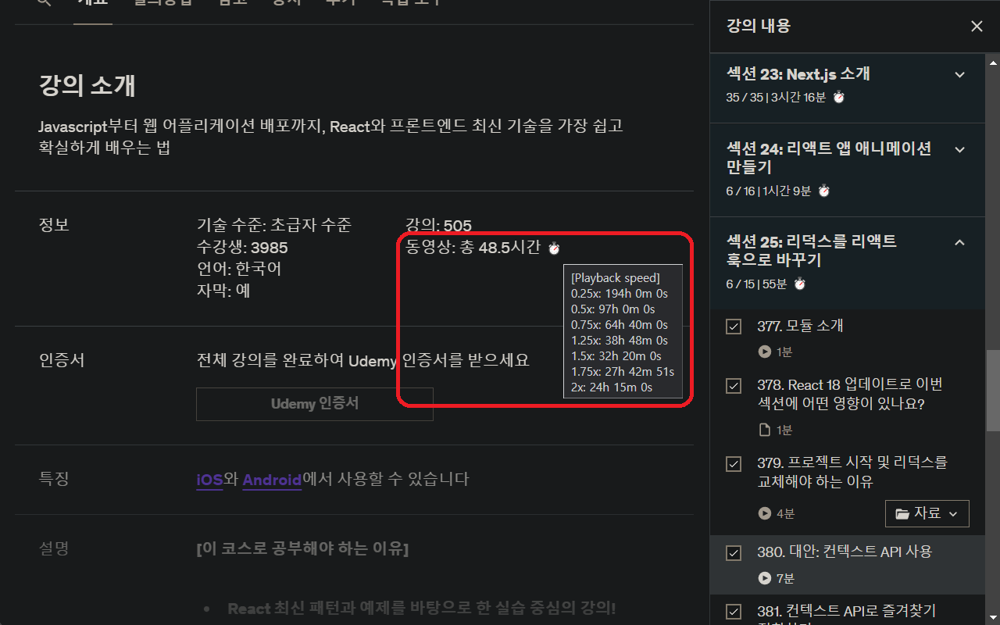

# Playback Time Calculator | YouTube, Udemy

| This extension displays time by playback speed of videos and playlists.

## Screenshot

## Features:

Displays the time by playback speed of video.
Displays the total playing time of the playlist(by playback speed).

## How to use:

⏱: Time is displayed by playback speed when you mouse over it.

## Caution:

If there are more than 100 videos in the playlist, scroll down and it will be counted again when loading is complete. - youtube

## TODO

- [x] Chrome Extensions
- [ ] Safari Extensions
- [ ] Firefox Add-ons
